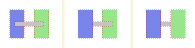

This document tries to describe the organising principles behind the
overlap checker.

These tools are inspired by the https://github.com/ukaea/parallel-preprocessor/
previously written by Qingfeng Xia.

# Users

There are currently two groups of users these tools are being designed
to support:

1. CAD-CI, i.e. automatic validation of CAD models. Currently this is
   just making sure that models are self consistent, no significant
   overlaps.
2. Neutronics modelling, i.e. preprocessing CAD models so they can be
   used with tools like DAGMC.

# Terminology

 * A **solid** is a 3D volume described by a set of faces, edges, and
   verticies.
 * Solids **intersect** when some point exists that is within (or on
   the surface of) both solids. It's useful to distinguish between
   these cases:
   * Intersecting solids **touch** when the volume of intersection is
     empty. For example, a vertex of one solid lies on the face of
     another. Or, minimally, when two vertices are at the same
     location.
   * Intersection solids **overlap** when the volume of the
     intersection is not empty. E.g. points exist that are within the
     shapes.
 * Solids are **distinct** when they do not intersect in any way. For
   example, their bounding boxes do not overlap. Note that this can
   get awkward to determine, e.g. a cylinder could have a torus around
   it whose "hole" has a larger diameter than the cylinder.

# Model representation

The parts of the CAD we really care about are the solid parts and
their physical properties, like material. Some operations mutate these
parts (e.g. the imprint step) and we still want to be able to
reference the parts consistently.

CAD models tend to be hierarchical (it makes it easier to work on them
like this) but this makes referring to parts awkward. The way I've
chosen is to "linearise" the hierarchy of solids into a list, and
maintain this linear order across related files and operations.

For example, when checking for overlapping solids it's easy to
determine which solids to iterate over, and when imprinting any
modified solid would be written back the same index in the BREP file.
This allows metadata (e.g. material properties) to be maintained in a
separate database which can be easily matched up again at the end.

# OpenCascade

The code uses OpenCascade, which exposes iterators (e.g.
`TopoDS_Iterator`) that return objects in a consistent order. If this
breaks at some point each solid could be written to its own file,
except for the final merge step.

Performance wise, OpenCascade takes ~100 times longer to open a STEP
file than a BREP file. So if this can be done once it seems like a
win.

The OpenCascade "Pave" tool allows boolean operations to be performed
between arbitrary solids. The tool is initialised and can then be used
to get a union, or to cut one part out of another. Note that this API
is awkward to use efficiently and it's easy to make the library do
much more work than is necessary!

# Tool functionality

The project consists of several small tools that can be combined in a
variety of ways to solve different tasks. These are described in the
following sections, e.g. the CAD-CI users would just need an import,
the overlap checker, and optionally the collector to help determine
which solids are overlapping.

# Import

The source data needs to be imported and the solids linearised and
written to a BREP file for use by other tools. As part of this these
tools attempt to extract material properties and write them to a CSV
file, but I don't get anything useful from the files I have at the
moment. `step_to_brep` works with STEP files, while `brep_flatten`
allows an existing BREP file to be worked with.

`step_to_brep` contains code to validate that the input file has been
interpreted correctly, but this might be worth splitting out into a
separate tool as more input formats are supported.

# Overlap checking

Once the solids have been linearised, it's a simple matter of
performing `N * (N-1)` checks to determine which solids intersect with
each other. The cases we care about are:

 * distinct
 * touching
 * overlapping

Note, due to human and machine precision issues, some edge cases
arise:

 * Models often contain shapes that should be connected, but don't
   actually touch. Therefore, this code considers solids that are less
   than some user-specified tolerance (e.g. 0.001mm) from each other
   to be touching.
 * Similarly, it's useful to distinguish between shapes that overlap
   by some small user-specified amount (e.g. less than 0.5% of their
   volume) and those which overlap more significantly.

When used for validation of CAD models, it is enough to ensure that no
significant overlaps exist.

The `overlap_checker` tool outputs all intersecting solids to a CSV
file. The `overlap_collecter` reads this output to create a BREP file
containing just the overlapping volumes, which can be loaded along
with the original model to determine where they are.

# Model clean-up

For a model to be used in (e.g.) neutronics modelling, we need to
remove any overlaps between solids (`imprint_solids`) and merge
vertexes/edges/faces (`merge_solids`) where appropriate.

Physical models want every point in space to either be in a single
solid or be empty space. Any points within an intersection cause
ambiguity which cause models to fail. Imprinting aims to automatically
fix geometries containing overlaps.

Models also tend to assume that transitions between solids occur via
shared faces. For example, two adjacent cubes should share adjacent
faces to indicate they touch each other. Otherwise the model might
interpret this as needing a particle to transition from solid, into
air, then back into a solid.

## Imprint stage

Imprinting uses boolean operations to remove any overlap from the
smaller shape. The algorithm proceeds pairwise over our list of
shapes:

```python
for i, j in overlapping_pairs:
    # ensure we're cutting from the smaller shape
    assert shapes[j].volume < shapes[i].volume
    shapes[j] = shapes[j] - shapes[i]
```

where `S - T` is shape `S` with any intersection of `T` removed. As a
simple example, suppose we have three overlapping shapes as shown on
the left below.



The overlap checker should identify two overlapping pairs, the
blue-grey pair and the green-grey. The imprint algorithm might be
arbitrarily presented with the blue-grey pair first, so removes the
intersection from the grey shape due to it being smaller. This
intermediate result is shown in the middle. Next the algorithm
processes the green-grey pair, and again removes material from the
smaller grey object. The final result is shown on the right.

Note that shapes are modified in-place, so to be deterministic the
pairs need to be presented in the same order (in the general case).

## Merge stage

Merging currently assumes that solids should be fixed to each other,
I'm not aware of anything in the input files to describe when this
isn't the case.

Merging uses the [SALOME Platform's](https://www.salome-platform.org/)
[GEOMAlgo_Gluer2][] code to perform this merge. It iterates over
solid, recursively processing faces, edges and vertexes merging those
that overlap. It is therefore important that this stage is run after
imprinting to allow touching faces/edges/vertices to be merged.

[GEOMAlgo_Gluer2]: https://docs.salome-platform.org/latest/tui/GEOM/classGEOMAlgo__Gluer2.html
